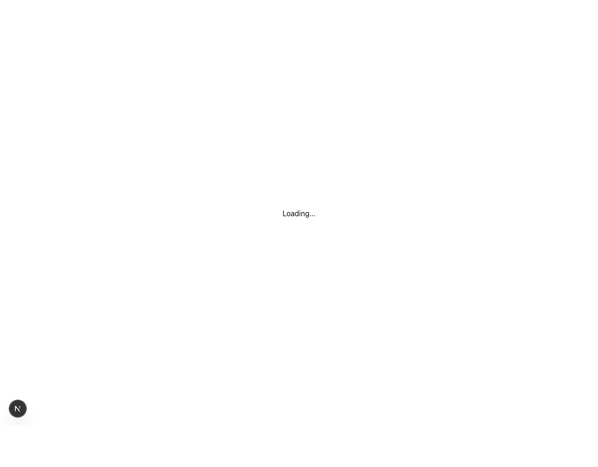
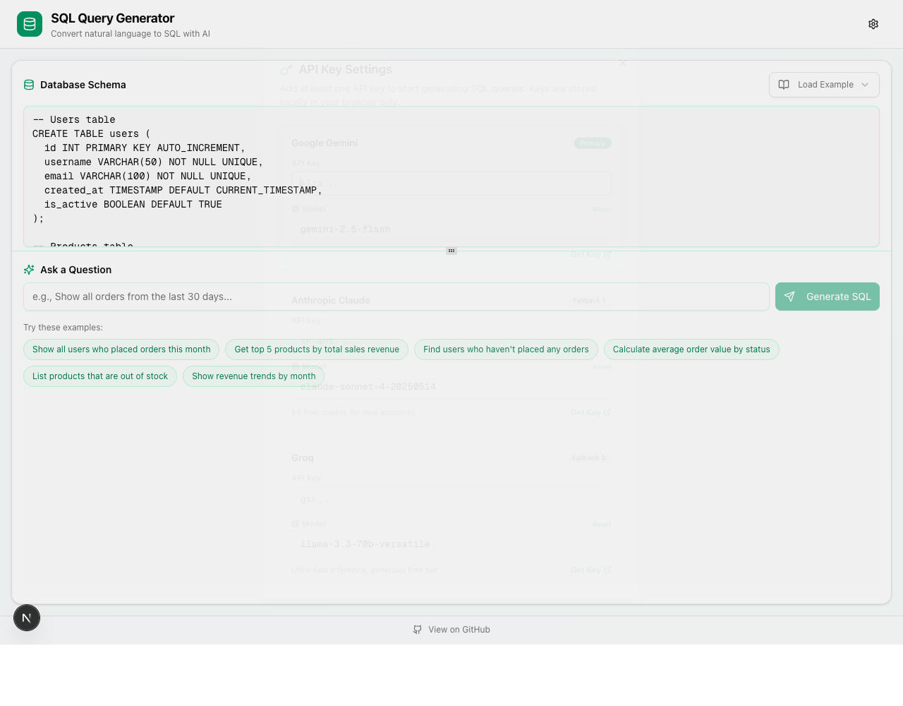

# 🤖 SQL Query Generator

**Convert Natural Language to SQL with AI — Seamlessly.**

SQL Query Generator is a modern, high-performance Next.js application designed to transform complex human questions into accurate, production-ready SQL queries. It supports multiple AI providers, automatic fallbacks, and a customizable schema interface.

[](https://cj-sql-generator.vercel.app)
[](https://nextjs.org/)
[](https://tailwindcss.com/)
[](LICENSE)

---

## 📸 Screen Captures

### **Main Application Interface**
*Easily input your database schema and ask questions in natural language.*


*(Example: Generating a complex JOIN query between 'users' and 'orders')*

### **AI Provider Settings**
*Configure multiple API keys and select your preferred models for generation and fallback.*


*(Available Providers: Gemini, Claude, Groq, Cerebras, OpenRouter)*

---

## ✨ Key Features

- **🚀 Instant Generation:** Translate questions like *"Show me the top 5 users by total order value"* into SQL instantly.
- **📚 Schema-Aware:** The AI understands your specific table structures, types, and relationships.
- **🔄 Multi-Provider Fallback:** If one AI provider is down or fails, it automatically tries the next one in the chain.
- **🛠️ Flexible Schemas:** Supports MySQL, PostgreSQL, and standard SQL syntax.
- **🔒 Privacy First:** API keys are stored **only** in your browser's local storage (client-side only).
- **🎨 Responsive Design:** A polished, resizable UI that works across desktop and mobile.

---

## 🛠️ Tech Stack

- **Framework:** [Next.js 15](https://nextjs.org/) (App Router)
- **Styling:** [Tailwind CSS 4](https://tailwindcss.com/)
- **Components:** [Shadcn UI](https://ui.shadcn.com/) (Radix UI)
- **AI Integration:** Direct API integration with Gemini, Anthropic, Groq, etc.
- **Icons:** [Lucide React](https://lucide.dev/)
- **Runtime:** [Bun](https://bun.sh/) (Recommended)

---

## 🚀 Getting Started

### 1. Installation
```bash
git clone https://github.com/CJ-1981/sql-query-generator.git
cd sql-query-generator
bun install
```

### 2. Database Setup (Optional)
This project uses SQLite for local tracking (if needed).
```bash
bun run db:push
bun run db:generate
```

### 3. Start Development
```bash
bun run dev
```
Open [http://localhost:3000](http://localhost:3000) in your browser.

---

## ⚙️ Configuration

1. Open the **Settings** (gear icon) in the header.
2. Enter your API keys for the providers you wish to use (e.g., [Google AI Studio](https://aistudio.google.com/), [Groq Console](https://console.groq.com/)).
3. (Optional) Customize the specific model names you want to use.
4. Save settings and start generating!

---

## 📄 License

This project is licensed under the MIT License.

---

*Built with ❤️ using Gemini CLI and Next.js.*
